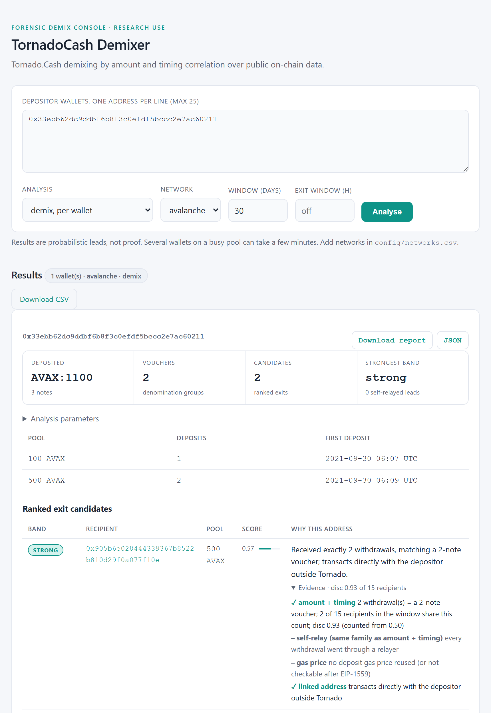
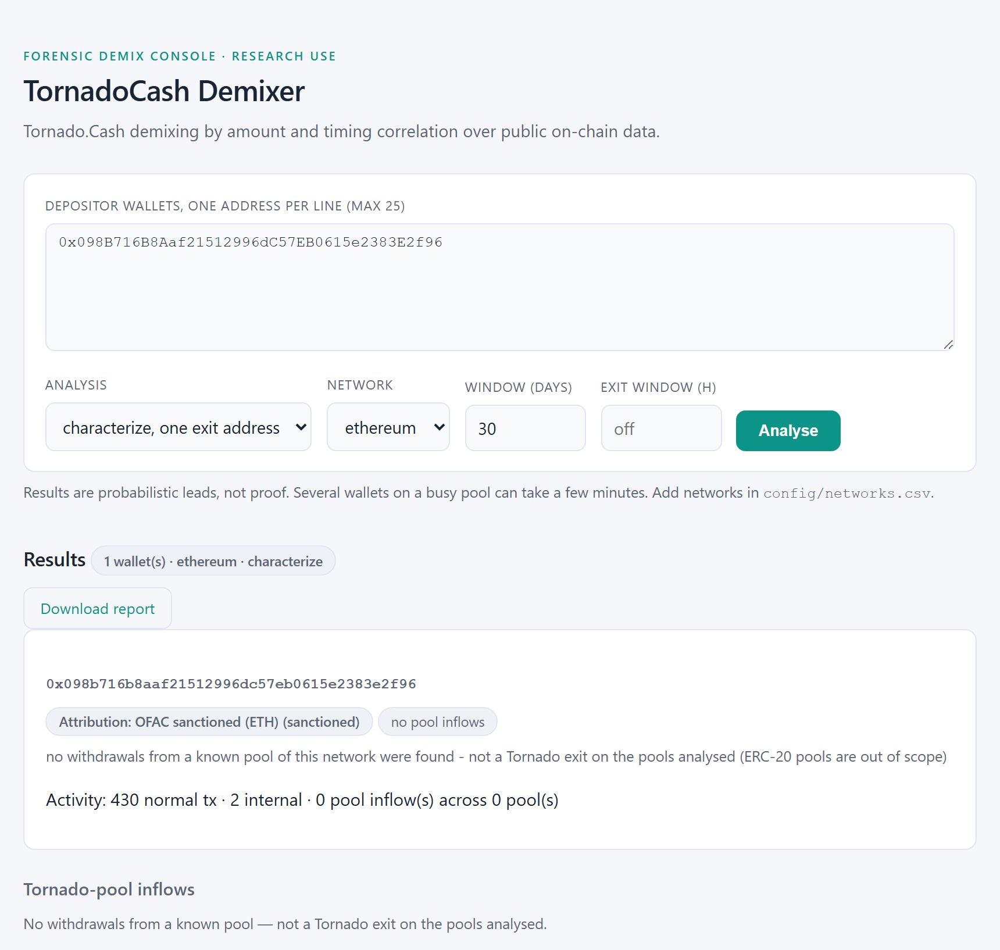
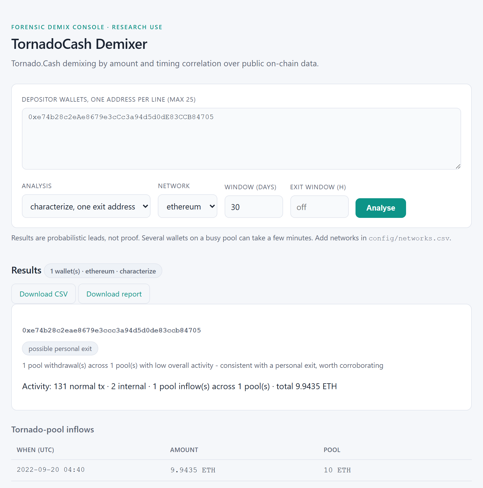
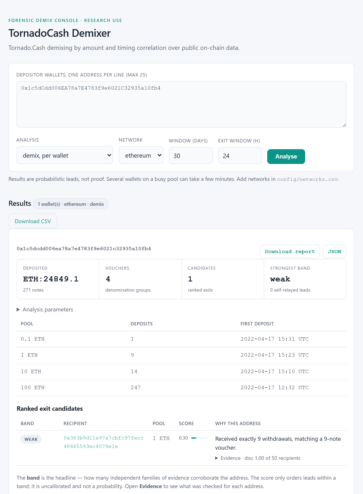

# TornadoCash Demixer

Probabilistic demixing of Tornado Cash deposits using only public on-chain data.
The toolkit links a depositor wallet to likely withdrawal addresses by amount and
timing correlation, adds independent signals where they exist, and reports each
candidate with an evidence band. It is the practical part of the master's thesis
"Methods, models and software implementation of probabilistic demixing of
crypto-asset mixer transactions".

Output is a set of leads for further investigation, not proof. Tornado Cash breaks
the deposit-withdrawal link cryptographically; the tool looks for behavioural
traces users leave around it.

## What it does

- Finds a wallet's deposits into the 55 registered pools on 8 EVM networks
  (native transfers, internal transfers from contract wallets, ERC-20 transfers,
  direct or through a router).
- Groups deposits into vouchers (one pool, one session, `--gap-hours`, default 24)
  and gives each voucher its own withdrawal search window.
- Reads the pools' `Withdrawal` events in those windows and counts how many
  withdrawals each recipient received. A recipient that received exactly *N*
  withdrawals matches a voucher of *N* notes.
- Scores every recipient: a count match weighted by how much of the recipient
  field it eliminates (`disc`; counted only at `disc >= 0.5` in a field of at
  least 5 recipients), self-relayed withdrawals, reuse of a deposit gas price
  (only in blocks without an EIP-1559 base fee), and direct transactions with the
  depositor (not counted when the counterparty is a contract).
- Reports a band per candidate: `strong` (two or more independent evidence
  families), `moderate` (one family plus a structural tie), `weak` (amount and
  timing only), with the evidence behind it: every family, whether it holds,
  and the numbers (share of the recipient field with the same count, `disc`,
  gas price). Candidates are ordered by band, then by an uncalibrated noisy-OR
  score taken across evidence families (within a family only the strongest
  signal counts). Reports state the analysis parameters and the block ranges read.
- For several wallets: shared candidates, denomination-profile matches,
  cross-wallet consolidators graded against the window-overlap artefact, deposit
  synchronicity, and operator clusters (union-find on discriminating edges only).
- Traces split exits one hop forward to a common collection address (`cluster`).
- Characterises an exit candidate: activity, pool inflows, next hops, optional
  address labels (`characterize`).

The method, thresholds and the reasoning behind them are in
[docs/METHODOLOGY.md](docs/METHODOLOGY.md).

## Components

| Module | Role |
|---|---|
| `tornado_demix/demix.py` | deposit detection, vouchers, search windows, withdrawal counting |
| `tornado_demix/heuristics.py` | signals, `count_discrimination`, noisy-OR score, bands |
| `tornado_demix/multi.py`, `graph.py` | multi-wallet correlation, consolidator grading, clustering |
| `tornado_demix/cluster.py` | one-hop tracing of split exits, on-disk cache |
| `tornado_demix/characterize.py`, `attribution.py` | recipient-side analysis, address labels |
| `tornado_demix/etherscan.py`, `rpc.py`, `events.py` | explorer client, JSON-RPC probes, event decoding |
| `tornado_demix/networks.py`, `pools.py`, `data/networks.csv` | verified pool registry |
| `tornado_demix/report.py` | CSV and self-contained HTML reports |
| `tornado_demix/cli.py`, `webui/app.py` | command line and local Flask UI over the same functions |
| `tools/verify_pools.py` | on-chain verification of registry entries |
| `tools/calibrate.py` | precision/recall against confirmed cases (needs private data) |
| `tools/sensitivity.py` | ranking stability of saved results under perturbed weights |

## Requirements

- Python 3.9 or newer. Runtime dependency: `requests`. The web UI adds `flask`.
- An Etherscan V2 API key. One key covers Ethereum, BNB Smart Chain, Polygon,
  Arbitrum, Base and Gnosis. Avalanche (Routescan) and Optimism (Blockscout) need
  no key. On the free Etherscan plan the `getLogs` endpoint was not
  available for BNB Smart Chain, Gnosis and Base at the time of writing.

## Installation

From a checkout of the repository:

```bash
python -m pip install .            # core: the tornado-demix command and the pool registry
python -m pip install ".[web]"     # plus Flask; run the UI from a checkout
python -m pip install -e ".[dev]"  # for development: tests and ruff
```

Dependencies and their version bounds are declared in `pyproject.toml`.

## Configuration

Copy `config/api.csv.example` to `config/api.csv` and put your key in it, or set
`ETHERSCAN_API_KEY`:

```csv
service,api_key
etherscan,YOUR_KEY
```

Config files are looked up in `$TORNADO_DEMIX_CONFIG` (only there, when set),
then `./config/`, then the repository's `config/`. One directory per case keeps
case inputs apart. `config/wallets.csv` (column `address`) can replace addresses
on the command line. `config/networks.csv`, if present, overrides the bundled
registry.

### Address labels (optional)

Labels are not bundled. The tool reads one `<network>.csv` per chain
(`ethereum.csv`, `bsc.csv`, ...) with an `address` column and optionally `entity`,
`label`, `category`, `source`, `confidence`, from the directory given by
`--attribution-dir` or `TORNADO_DEMIX_ATTRIBUTION`.

A ready dataset in this format is
[prettydeath/wallet-attribution](https://github.com/prettydeath/wallet-attribution):
about 115,000 addresses (exchanges, OFAC-sanctioned entities, scams, mixers,
bridges, DeFi) on 47 networks, covering all eight networks of this tool.

```bash
git clone https://github.com/prettydeath/wallet-attribution
python -m tornado_demix characterize <address> --attribution-dir wallet-attribution/data
```

It is aggregated from public sources: the OFAC SDN address list (US government
public record, via 0xB10C/ofac-sanctioned-digital-currency-addresses),
dawsbot/eth-labels, tradezon/cex-list, MyEtherWallet/ethereum-lists and the
proof-of-reserves wallets in DefiLlama-Adapters. The dataset's code is MIT; each
label keeps the license of its upstream source, so check those before
redistributing labels or using them commercially.

Labels are only displayed. They never change a score or a band, and a label is
a claim by its source, not a finding of this tool.

## Command line

```bash
# one wallet: CSV files, an HTML report and the full result as JSON
python -m tornado_demix demix 0x019b5bb2051797e33f726d0e7a8cb9b9c2003ac2 \
    --network ethereum --out-dir out/demix --report out/demix.html --json out/demix.json

# narrow the search to 6 hours after each voucher's last deposit
python -m tornado_demix demix <wallet> --exit-window 6

# several wallets
python -m tornado_demix multi <wallet1> <wallet2> --report out/multi.html
python -m tornado_demix multi --wallets-csv config/wallets.csv

# split exits, one hop forward (resumable cache in --cache-dir)
python -m tornado_demix cluster <wallet> --cache-dir .cache/case-42

# describe an exit candidate
python -m tornado_demix characterize <address> --attribution-dir path/to/labels
```

`python -m tornado_demix <command> --help` lists every option. A configuration or
provider error exits with a non-zero status and a one-line message. Progress goes
to stderr; the summary to stdout.

## Web UI

```bash
python webui/app.py      # http://127.0.0.1:5000
```

The form runs the same four analyses. For a demix run it shows the strongest
band, the ranked candidates with their band and score, and for each candidate an
**Evidence** panel listing every evidence family that was checked, whether it
holds, and the numbers behind it. **Analysis parameters** lists the assumptions
(voucher gap, window, thresholds) and the block ranges read. The CSV table, the
HTML report and the full JSON result can be downloaded.



The UI binds to localhost and has no authentication or CSRF protection; see
[SECURITY.md](SECURITY.md).

## Documented cases

The three cases below have an external source of truth and can be re-run from the
addresses shown. In each, the tool does not recover the laundering path; it shows
facts that can be checked independently.

| Case | Command | What the tool shows | Needs |
|---|---|---|---|
| Ronin Bridge exploiter `0x098B716B8Aaf21512996dC57EB0615e2383E2f96` | `characterize` | the address labelled as OFAC-sanctioned; its next transactions: contract calls to Circle: USDC and the Ronin Bridge, and 12,595 ETH sent to a second sanctioned address | the wallet-attribution dataset (it contains these OFAC SDN entries); without labels the same hops are shown unlabelled |
| Wintermute attacker `0xe74b28c2eAe8679e3cCc3a94d5d0dE83CCB84705` | `characterize` | one inflow of 9.9435 ETH from the 10 ETH pool on the day of the attack | API key |
| Beanstalk attacker `0x1c5dCdd006EA78a7E4783f9e6021C32935a10fb4` | `demix --exit-window 24` | 271 deposits (247 x 100, 14 x 10, 9 x 1, 1 x 0.1 ETH) within about three hours; no candidate above `weak` | API key |

Sources: [OFAC action of 14 Apr 2022](https://ofac.treasury.gov/recent-actions/20220414),
[Merkle Science on Wintermute](https://www.merklescience.com/blog/hack-track-analysis-of-wintermute-attack),
[Merkle Science on Beanstalk](https://www.merklescience.com/blog/hack-track-analysis-of-beanstalk-flash-loan-attack).
Attributing the Ronin theft to Lazarus was government intelligence, not on-chain
analysis; the identity of the other two attackers is not established.





A new run can show slightly different counts as the chain grows and open search
windows are clamped to the current block.

## Limitations

- Leads, not proof. The weights and `MIN_COUNT_DISCRIMINATION = 0.5` are expert
  judgements; the score has not been calibrated on cases with known outcomes.
  The band does not depend on the weights at all; they only order candidates
  within a band (check a saved result with `tools/sensitivity.py`).
- Single-note vouchers cannot be narrowed by count: every recipient in the
  window has count 1.
- Busy pools and long windows produce many equal counts. `--exit-window` trades
  recall for discrimination.
- A careful user defeats the method: relayers, long delays, split withdrawals
  to fresh addresses. The result is then "no lead", or weak leads on unrelated
  addresses that happen to share the voucher count, never a corroborated one.
- Only Tornado Cash pools in the registry are covered. Bridges, other mixers and
  cross-asset hops are not followed; `cluster` follows one hop only.
- Native chains other than Ethereum, Polygon and Avalanche have no verified
  router in the registry, so routed deposits there are not detected.
- `characterize` counts inflows from native pools only.
- Results depend on the explorer API. Provider failures raise errors instead of
  returning empty results, and pools whose search window cannot be resolved are
  reported as not searched.

## Development

```bash
python -m pytest -q          # network access is blocked in tests
python -m pytest -m live     # on-chain registry check, needs network
python -m ruff check . && python -m ruff format --check .
```

Weight sensitivity of saved results (no API calls):

```bash
python tools/sensitivity.py out/demix.json:<expected exit> --samples 1000 --spread 0.5
```

CI runs the tests on Linux and Windows with Python 3.9 and 3.13, a test under a
legacy Windows codepage, the linter, and a wheel install check.

## Legal and ethical use

For research, compliance and authorised investigations. Every address processed
is public on-chain data, but a label or a band attached to an address is an
allegation about a person. Corroborate any lead independently before it appears
in a report, a referral or a freeze request, and follow the terms of service of
the data providers you use.

## License

MIT, see [LICENSE](LICENSE).
